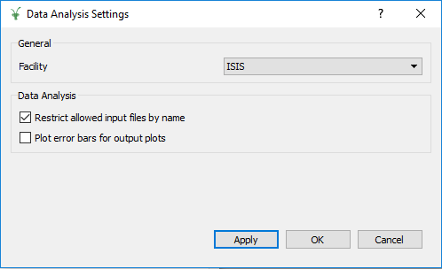

=========================
Indirect Geometry Changes
=========================

.. contents:: Table of Contents
   :local:

.. warning:: **Developers:** Sort changes under appropriate heading
    putting new features at the top of the section, followed by
    improvements, followed by bug fixes.

:ref:`Release 4.1.0 <v4.1.0>`

Algorithms
----------

Improvements
############

- :ref:`ModeratorTzeroLinear <algm-ModeratorTzeroLinear>` permits now passing parameter values as input properties.
- :ref:`BASISCrystalDiffraction <algm-BASISCrystalDiffraction>` resolves between run with old and new DAS.

All Indirect Interfaces
-----------------------

New Features
############
- A :ref:`Settings <interface-indirect-settings>` GUI is now available and can be opened using the button
  next to the help *?* button on the bottom left of the interfaces.

Data Analysis Interface
-----------------------

New Features
############
- The *Settings* GUI allows you to turn off the restriction of input data based on their name.
- The *Settings* GUI allows you to turn on error bars for the output plots.

Bug Fixes
#########
- Fixed an error caused by loading a Sample into ConvFit which does not have a resolution parameter for the analyser.

Data Corrections Interface
--------------------------

New Features
############
- The *Settings* GUI allows you to turn off the restriction of input data based on their name.
- The *Settings* GUI allows you to turn on error bars for the output plots.

Data Reduction Interface
------------------------

New Features
############
- The *Settings* GUI allows you to turn off the restriction of input data based on their name.
- The *Settings* GUI allows you to turn on error bars for the output plots.

Bug Fixes
#########
- Fixed a bug in the :ref:`Integration <algm-Integration>` algorithm causing the Moments tab to crash.

Bayes Interface
---------------

New Features
############

- The *Settings* GUI allows you to turn off the restriction of input data based on their name.
- The *Settings* GUI allows you to turn on error bars for the output plots.
